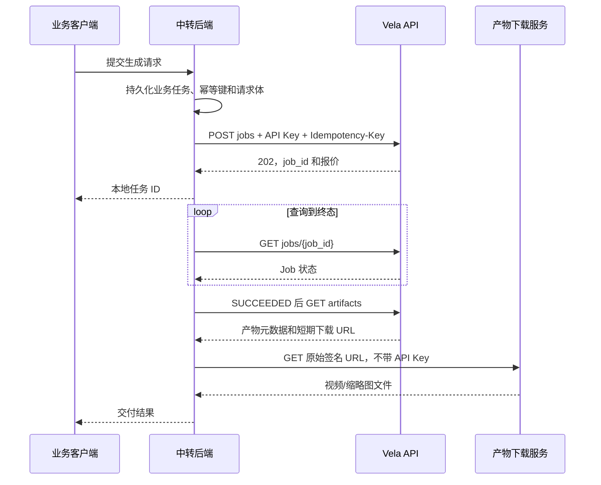

# Vela 视频生成 API 接入指南

面向通过后端中转接入 Vela 的团队。接口版本：`v1`；文档核对日期：2026-09-16。

我们提供 API Key 和 Project 配置；中转服务负责调用 Vela，并将任务状态和视频结果交付给自己的用户。API 使用 HTTPS、Bearer 认证和 JSON，视频生成采用异步任务模式。

配套文件：[中转接口 OpenAPI](api-integration.openapi.json)，可导入 Postman、Apifox 或 Swagger Editor。文件中的服务器地址是示例，导入后替换为交付地址。

## 1. 接入前拿到这些配置

| 配置 | 说明 |
| --- | --- |
| `BASE_URL` | API 根地址，包含网关路径前缀，例如 `https://vela-api.example.com/api`，不带结尾 `/` |
| `API_KEY` | 我方签发的完整密钥，原样放入 `Authorization: Bearer …` |
| `PROJECT_ID` | 与该 Key 绑定的 Project UUID；仅有 Key 还不足以构造请求 URL |
| 可用生成组合 | `model`、`generation_preset`、`service_class`、`output_spec`，以及允许的任务类型、时长、画幅和生成数量 |
| 配额与保留期 | 项目排队/运行限制、网关请求频率、合同额度、产物保留期，由我方交付 |
| 网络与证书 | 可访问的 API/下载域名；使用私有 CA 的环境还需安装我方提供的 CA 证书 |

基础 Key 需要 `jobs:submit`、`jobs:read`、`jobs:cancel`、`artifacts:read` 四项权限。Webhook 是可选能力，另需开通对应权限及投递配置。

**示例参数用于说明接口，是否可调用以我方交付的已开通组合为准。** Schema 允许的枚举和数值范围不等于所有组合都已开通；目前没有面向接入方的模型/规格列表 API。2026-09-16 已通过 Marslab 的真实 H3 业务验收：提交、查询、完整 124 帧音视频及缩略图下载、对象完整性、单次计费和幂等检查全部通过，见[验收报告](h3-api-repair-2026-09-16.md)。该结果仅覆盖报告中明确列出的生成组合与验证环境。

Key 由中转后端保管。中转服务需要自行认证用户，并保存“本地用户/任务 → Vela Project/Job”的归属关系：同一 Project Key 的权限覆盖该 Project，不按 `client_metadata` 中的用户字段隔离。

## 2. 调用流程和接口总览



以下路径均追加在 `BASE_URL` 后。`project_id`、`job_id` 均为 UUID。

| 操作 | 方法与路径 | 成功 HTTP 状态 | Key 权限 |
| --- | --- | --- | --- |
| 提交任务 | `POST /v1/projects/{project_id}/jobs` | `202` | `jobs:submit` |
| 查询任务 | `GET /v1/projects/{project_id}/jobs/{job_id}` | `200` | `jobs:read` |
| 取消任务 | `POST /v1/projects/{project_id}/jobs/{job_id}/cancel` | `200` | `jobs:cancel` |
| 获取产物和下载链接 | `GET /v1/projects/{project_id}/jobs/{job_id}/artifacts` | `200` | `artifacts:read` |

当前生成 API 不提供 SSE、WebSocket 或同步返回视频的接口。收到 `202` 只表示任务已持久化受理；是否生成成功，以查询结果 `state=SUCCEEDED` 为准。

通用请求头：

```http
Authorization: Bearer <API_KEY>
Accept: application/json
Content-Type: application/json
```

`Content-Type` 用于有 JSON 请求体的调用。提交任务还必须提供 `Idempotency-Key`。JSON 请求体上限为 **1 MiB**；生成请求的已定义对象拒绝未知字段，业务附加字段放入 `client_metadata`。

## 3. 提交视频生成任务

### 3.1 最小可用示例

以下示例使用 2026-09-16 已核验的 Marslab 组合：`model=minimax-h3-live-validation`、`generation_preset=fast`、`service_class=standard`、`output_spec=h3-native-av-1344x768-5s-24fps`，文本生成 5 秒、768 短边、`16:9` 音视频。当前价格表为 ¥1.00/条，实际报价以受理响应为准。

`minimax-h3` 不是当前环境的模型标识；`balanced`、`quality`、10 秒及纯视频规格也未开通。不能用 Schema 支持的枚举推断当前可购买组合。`h3.sampling` 必须显式传入 `num_inference_steps=20`、`quality=lossless`。

配置环境变量；密钥通过自己的 Secret 管理方式注入 `VELA_API_KEY`，不要写入源代码：

```bash
export VELA_BASE_URL='https://vela-api.example.com/api'
export VELA_PROJECT_ID='11111111-1111-4111-8111-111111111111'
# VELA_API_KEY 已由运行环境注入。
# Marslab 域名入口设置 CURL_CA_BUNDLE=/path/to/marslab-root-ca.crt。
```

将以下内容保存为 `request.json`：

```json
{
  "model": "minimax-h3-live-validation",
  "generation_preset": "fast",
  "service_class": "standard",
  "output_spec": "h3-native-av-1344x768-5s-24fps",
  "generation_count": 1,
  "prompt": "清晨的海边，镜头缓慢向前推进，海浪轻拍沙滩，伴随自然海浪声。",
  "client_metadata": {
    "business_task_id": "video-demo-20260916-0001"
  },
  "h3": {
    "sampling": {"num_inference_steps": 20, "quality": "lossless"},
    "task": "t2va",
    "seed": 42,
    "target": {
      "short_edge": 768,
      "aspect_ratio": "16:9",
      "duration_seconds": 5
    }
  }
}
```

为这一个业务任务分配并持久化唯一幂等键。以下固定值仅用于演示一个任务；新任务必须换新值，重试同一个任务保持原值：

```bash
export VELA_IDEMPOTENCY_KEY='relay-video-demo-20260916-0001'

curl --silent --show-error --fail-with-body \
  --connect-timeout 10 --max-time 30 \
  --dump-header submit.headers --output submit.json \
  -X POST "$VELA_BASE_URL/v1/projects/$VELA_PROJECT_ID/jobs" \
  -H "Authorization: Bearer $VELA_API_KEY" \
  -H 'Content-Type: application/json' \
  -H 'Accept: application/json' \
  -H "Idempotency-Key: $VELA_IDEMPOTENCY_KEY" \
  --data-binary @request.json
```

检查 `submit.headers` 的 HTTP 状态后处理 `submit.json`。下列是 **202 响应的结构示例**，ID、时间和价格均为示意值，并非实际报价：

```json
{
  "job_id": "22222222-2222-4222-8222-222222222222",
  "project_id": "11111111-1111-4111-8111-111111111111",
  "state": "QUEUED",
  "attempts_started": 0,
  "pricing": {
    "rate_card_revision_id": "33333333-3333-4333-8333-333333333333",
    "rate_line_id": "44444444-4444-4444-8444-444444444444",
    "unit_amount_minor": 100,
    "quantity": 1,
    "quoted_amount_minor": 100,
    "currency": "CNY"
  },
  "job_expires_at": "2026-09-16T06:00:00Z",
  "created_at": "2026-09-16T04:00:00Z"
}
```

立即持久化 `job_id`、`project_id`、幂等键、原请求体和 `pricing`。查询接口不返回原始 prompt 或 `client_metadata`，也没有任务列表接口供中转恢复丢失的本地映射。

### 3.2 请求字段

| 字段 | 必填 | 约束与含义 |
| --- | --- | --- |
| `model` | 是 | 我方交付的模型标识；当前 Marslab 为 `minimax-h3-live-validation`；非空，最多 100 字节 |
| `generation_preset` | 是 | Schema 支持 `quality`、`balanced`、`fast`；当前 Marslab 仅开通 `fast` |
| `service_class` | 是 | 当前只接受 `standard` |
| `output_spec` | 是 | 我方交付的输出规格标识；非空，最多 100 字节 |
| `generation_count` | 是 | 整数，Schema 范围 1–16；初次联调使用 1，批量能力以交付配置为准 |
| `prompt` | 是 | 1–20,000 个 Unicode 字符 |
| `client_metadata` | 否 | JSON 对象；用于业务标识。其内容参与幂等比较，重试时保持不变 |
| `h3` | 否 | H3 参数对象；省略时使用以下默认值 |

| H3 字段 | 默认值 | 约束与含义 |
| --- | --- | --- |
| `h3.task` | `t2va` | `t2va` 文本生成；Schema 另接受 `ref2va`、`fl2va` 条件生成 |
| `h3.seed` | 服务端派生 | 非负 int64。省略时根据幂等键和规范化生成参数派生；相同 seed 不代表不同环境下输出文件逐字节一致 |
| `h3.target.short_edge` | `768` | 当前只接受 `768` |
| `h3.target.aspect_ratio` | `16:9` | 与交付的输出规格匹配，不据此自行推导任意分辨率 |
| `h3.target.duration_seconds` | `5` | 正数，与输出规格一致；H3 原生音视频规格的当前媒体契约为 4–15 秒、24fps，但仍需逐个开通规格 |
| `h3.conditions` | 空 | `t2va` 必须为空；其他两种任务必须有条件输入，最多 64 项 |
| `h3.sampling` | 随档位确定 | 当前原生音视频发布必须显式传 20 步、`lossless`，见下文 |

当前 `h3-native-av-1344x768-5s-24fps` 使用固定的 20 步原生模型发布，请传 `"sampling":{"num_inference_steps":20,"quality":"lossless"}`。缺失或不匹配时返回 `400 invalid_request`，不会创建任务、占用额度或启动 Worker。已受理任务仍按原幂等记录重放。

默认采样配置：`quality` 为 50 步/`lossless`，`balanced` 为 30 步/`high`，`fast` 为 20 步/`high`。Schema 允许显式传 `num_inference_steps`（1–10,000）、`quality`（`high`/`lossless`）及两种条件噪声参数（0–1 或 null）；这些是接口约束，不是任意采样配置的质量、耗时或容量承诺。

条件生成需我方交付具体的 `role`/`type` 组合和输入格式后接入。每项必须带 `role`、`type`、稳定的 `uri`、可由 Vela 下载的 HTTPS `download_url`、64 位小写十六进制 `sha256`、`size_bytes`。单项 Schema 上限为 32 GiB；可选 `frame_index`、`start_time_seconds` 必须非负。输入 URL 有效期应覆盖排队和素材下载时间；重试时替换签名 URL 也可能触发幂等冲突。当前无公开素材上传/刷新接口，不能通过修改已受理任务的请求体来续签素材。

### 3.3 幂等规则：必须在中转实现

`Idempotency-Key` 长度 1–128，只允许 `A–Z a–z 0–9 . _ : -`。推荐使用持久化的 UUID 或带业务前缀的唯一任务 ID。

- **作用域是 Project。** 同一 Project 的多个中转实例或密钥应共用业务任务去重记录。
- 同一 Project、同一幂等键、相同规范化内容：返回原 `job_id` 及它的**当前状态**，HTTP 仍为 `202`；不会新增任务。重放时状态可能已是 `SUCCEEDED`。
- 同一幂等键但内容不同：返回 `409 idempotency_conflict`。修改 prompt、参数、`client_metadata` 或素材下载 URL 都可能产生冲突。
- 请求超时、断连或收到不确定的 5xx 后，使用**原 Key、原 Project、原请求体、原幂等键**重试。不要生成新幂等键，否则可能创建第二个计费任务。
- 新业务任务必须用新幂等键；不要在历史记录保留期结束后复用旧键。API 不承诺永久保留幂等记录。

## 4. 查询任务与轮询

```bash
export VELA_JOB_ID='22222222-2222-4222-8222-222222222222'

curl --silent --show-error --fail-with-body \
  --connect-timeout 10 --max-time 30 \
  "$VELA_BASE_URL/v1/projects/$VELA_PROJECT_ID/jobs/$VELA_JOB_ID" \
  -H "Authorization: Bearer $VELA_API_KEY" \
  -H 'Accept: application/json'
```

成功返回 `200`，响应结构与提交返回的 Job 相同。

| `state` | 中转处理 |
| --- | --- |
| `QUEUED` | 等待执行，继续查询 |
| `ASSIGNED` | 已分配执行资源，继续查询 |
| `RUNNING` | 正在生成，继续查询 |
| `FINALIZING` | 正在处理/验证/发布结果，继续查询 |
| `RETRY_WAIT` | Vela 正在安排内部重试；保留同一 `job_id`，不要另建任务 |
| `CANCELING` | 取消已进入处理流程，继续查询到终态 |
| `SUCCEEDED` | 成功终态；获取产物 |
| `FAILED` | 失败终态；停止轮询 |
| `CANCELED` | 取消终态；停止轮询，费用以取消决策为准 |

可选字段可能缺省，客户端应能处理：

| 字段 | 解释 |
| --- | --- |
| `phase` | `QUEUED`、`PREPARING`、`GENERATING`、`FINALIZING`、`RETRY_WAIT` |
| `phase_progress` | 当前尝试、当前阶段的进度，范围 `[0, 1)`；不是全任务百分比，重试后可以回退 |
| `attempts_started` | 已开始的尝试次数 |
| `next_retry_at` | 下一次内部重试时间 |
| `estimated_finish_at` | 动态估计完成时间，不是完成保证 |
| `progress_updated_at` | 最近进度更新时间；缺省时不要补造进度 |
| `job_expires_at` | 任务到期边界，不是承诺在此之前成功完成 |

时间字段使用 RFC 3339，示例以 UTC `Z` 表示。当前 Job 响应没有公开的 `failure_reason` 字段；终态 `FAILED` 的排查请提供 `job_id` 和请求关联信息。

**轮询建议属于中转实现策略：** 初期每个活跃任务约 5–10 秒一次并加入随机抖动，由后端集中轮询和缓存。多个用户查询同一任务时复用结果；收到 `Retry-After` 时按其等待。示例 cURL 的 30 秒是单次 HTTP 超时，生成任务可持续更久；HTTP 超时或用户关闭页面都不会自动取消 Vela Job。

仓库现有网关配置为**每个网关实例、每个来源 IP、每 60 秒 120 次请求**，提交和查询等请求共用该额度。它不是集群总配额或按 Key 独立配额，且实际交付环境可能调整。例如 20 个任务每 5 秒轮询一次即为 240 次/分钟，需要降低频率或采用 Webhook。不要通过切换网关节点规避配额。

## 5. 获取与下载结果

仅在 `state=SUCCEEDED` 后调用：

```bash
curl --silent --show-error --fail-with-body \
  --connect-timeout 10 --max-time 30 \
  "$VELA_BASE_URL/v1/projects/$VELA_PROJECT_ID/jobs/$VELA_JOB_ID/artifacts" \
  -H "Authorization: Bearer $VELA_API_KEY" \
  -H 'Accept: application/json' \
  --output artifacts.json
```

成功返回 `200`。以下结构示例只展示一个视频项；下载 URL、大小和哈希均为占位示例：

```json
{
  "artifact_set_id": "55555555-5555-4555-8555-555555555555",
  "job_id": "22222222-2222-4222-8222-222222222222",
  "retention_expires_at": "2026-09-23T04:10:00Z",
  "committed_at": "2026-09-16T04:10:00Z",
  "artifacts": [
    {
      "artifact_id": "66666666-6666-4666-8666-666666666666",
      "kind": "VIDEO",
      "ordinal": 0,
      "object_version_id": "example-version-id",
      "size_bytes": 1234567,
      "sha256": "0123456789abcdef0123456789abcdef0123456789abcdef0123456789abcdef",
      "content_type": "video/mp4",
      "download_url": "https://download.example.com/example.mp4?versionId=example-version-id&signature=EXAMPLE",
      "download_url_expires_at": "2026-09-16T04:15:00Z",
      "media": {
        "requested_duration_milliseconds": 5000,
        "duration_milliseconds": 5167,
        "container_duration_milliseconds": 5175,
        "frame_count": 124,
        "frame_rate_milli": 24000,
        "audio": {
          "codec": "aac",
          "sample_rate": 32000,
          "channels": 2,
          "duration_milliseconds": 5175
        }
      }
    }
  ]
}
```

遍历 `artifacts` 并按 `kind` 区分 `VIDEO` 与 `THUMBNAIL`，保留 `ordinal` 和 `artifact_id`；不要假定数组第一个元素一定是视频，也不要把缩略图计为生成数量。

下载协议：

1. 使用 API 返回的完整 `download_url` 发起 GET，保留路径、查询参数、签名和对象版本，不拼接 `BASE_URL`，不自行重写域名。
2. 使用独立的下载 HTTP 客户端，**不携带 Vela API Key**，也不把中转 Cookie 或其他认证头转发过去。只访问我方交付的允许下载域名。
3. 链接有效期以 `download_url_expires_at` 为准；当前签名期限上限为 15 分钟。过期时重新调用 `/artifacts` 获取新链接，无需重建任务。
4. `retention_expires_at` 是产物保留期，和短期签名链接有效期不同。保留期结束或产物已删除后，无法仅靠刷新链接恢复。
5. 流式写入文件，完成后核对 `size_bytes` 和 SHA-256；校验通过再向下游发布。签名 URL 可在有效期内授权下载，避免记录到公开日志。

使用 `jq` 选择第一个视频的演示：

```bash
VELA_DOWNLOAD_URL=$(jq -er 'first(.artifacts[] | select(.kind == "VIDEO")) | .download_url' artifacts.json)
curl --silent --show-error --fail \
  --proto '=https' --connect-timeout 10 --max-time 600 \
  "$VELA_DOWNLOAD_URL" --output video.mp4
```

上例不自动跟随重定向、不附加认证头；接入程序还应校验允许下载域名、HTTP 状态必须为 `200`，并完成大小和哈希校验。600 秒是示例下载超时，可按文件体积和带宽调整。

`media` 为可选媒体元数据。`frame_rate_milli=24000` 表示 24fps；`duration_milliseconds` 为实际视频轨时长，`audio.duration_milliseconds` 为音轨时长。H3 原生输出保留完整音视频，因此请求 5 秒可能返回约 5.167 秒视频、5.175 秒音频。按实际值展示，不要在中转层默默裁剪到请求时长。

在任务尚未成功、Project/Job 不匹配、产物过期或不可访问时，`/artifacts` 可能返回 `404`。先核对任务状态和保留期，不因一次 `404` 自动新建生成任务。

## 6. 取消任务与费用

取消接口没有请求体，也不要求 `Idempotency-Key`。可以对同一 Job 重复调用，读取已记录的取消决策：

```bash
curl --silent --show-error --fail-with-body \
  --connect-timeout 10 --max-time 30 \
  -X POST "$VELA_BASE_URL/v1/projects/$VELA_PROJECT_ID/jobs/$VELA_JOB_ID/cancel" \
  -H "Authorization: Bearer $VELA_API_KEY" \
  -H 'Accept: application/json'
```

未进入计费执行阶段就取消的响应示例：

```json
{
  "cancellation_id": "77777777-7777-4777-8777-777777777777",
  "job_id": "22222222-2222-4222-8222-222222222222",
  "decision": "CANCELED",
  "state": "CANCELED",
  "job_version": 2,
  "billable": false,
  "decided_at": "2026-09-16T04:01:00Z"
}
```

| `decision` | 含义与处理 |
| --- | --- |
| `CANCELED` | 取消决策已记录；结合 `state` 和 `billable` 处理，不单凭该枚举判断免费 |
| `CANCELING` | 已接受取消，停止执行尚在收敛；继续 GET 到终态。重复取消可能重放此前决策，最终状态以 GET 为准 |
| `ALREADY_SUCCEEDED` | 成功先于取消生效；按成功任务处理，调用 `/artifacts` 获取结果 |
| `ALREADY_FAILED` | 已经失败，停止轮询 |

费用规则：

- 受理时预留合同额度，`pricing` 是固定报价快照，并非“每轮查询扣费”。`quoted_amount_minor`、`unit_amount_minor` 使用币种最小单位，例如 CNY 的 100 表示 1 元；`quantity` 对应生成数量。
- 成功完成，按原报价确认费用；平台终止或最终失败不收费。
- **从未进入 `RUNNING` 就取消，不收费；一旦已进入 `RUNNING`，用户取消按完整报价收费，包括在 `FINALIZING` 时取消。** 不依据最后一次轮询看到的状态自行判断是否收费。
- 以取消响应中的 `billable` 和可选 `charge` 为准。`charge` 包含 `charge_id`、`amount_minor`、`currency`、`reason`、`posted_at`；`reason` 为 `VISIBLE_COMPLETION` 或 `CUSTOMER_CANCELLATION`。
- 浏览器断开或中转 HTTP 请求超时不会触发取消；中转不能把本地超时直接显示为“已取消且免费”。

## 7. 错误处理、重试和排查

Vela 应用错误采用以下结构，不嵌套在 `error` 或 `data` 中：

```json
{
  "code": "idempotency_conflict",
  "message": "Idempotency-Key was already accepted with different request content"
}
```

| HTTP 状态 | 常见 `code` | 中转处理 |
| --- | --- | --- |
| `400` | `invalid_request` | 检查字段、未知参数、JSON/UUID/请求体大小及幂等键格式；不自动重试相同错误 |
| `400` | `invalid_sku` | 生成组合未开通或不可用；核对我方交付的组合，不自行猜测新规格名 |
| `401` | `unauthorized` | Key 缺失、无效、过期或撤销；停止自动重试并更新配置 |
| `402` | `credit_limit_exceeded` | 合同额度不足；联系我方处理 |
| `403` | `forbidden` / `organization_inactive` | Project/权限不匹配或组织不可用；核对 Key 绑定与授权 |
| `404` | `not_found` | 任务不可见，或产物尚不可访问；结合调用接口核对 Project、Job、状态和保留期 |
| `409` | `idempotency_conflict` | 同一个幂等键对应不同内容；修正本地任务映射，不能自动换键重发 |
| `429` | `project_limit_exceeded`，或网关限流响应 | 若有 `Retry-After`，等待至少指定秒数；降低总调用频率 |
| `503` | `capacity_unavailable` / `identity_unavailable` | 暂无可用容量或认证依赖临时不可用；退避重试 |
| `500` | `internal_error` | 临时服务异常；有界退避重试并记录排查信息 |
| `502` / `504` / 网络超时 | 可能无 JSON | 网关/网络异常，受理结果不确定；提交时保持同一幂等键和请求体重试 |

网关可以返回文本、HTML 或不同 JSON 结构，不能无条件按上述 Error schema 解码。先检查 HTTP 状态和 `Content-Type`；解析失败时仍保留状态码，不把网关错误当成成功结果。

建议使用带抖动的指数退避，例如 2、4、8、16、30 秒，最大间隔 30 秒；若服务端要求更长的 `Retry-After`，以服务端值为准。设置总重试预算。预算耗尽后保存为“受理结果待确认”，保留原幂等键和请求体供后台恢复，不自动认定“未创建任务”。对于已拿到 `job_id` 的任务，直接继续 GET。

保留：本地业务任务 ID、Project/Job ID、幂等键、HTTP 状态、错误 `code`、发生时间和响应中的 `X-Request-ID`（如有）。应用启用 HTTP 观测时生成 `X-Request-ID`，不会采用客户端传入的同名值。Error schema 中的 `request_id` 是可选项，不保证响应体一定包含。日志中不要记录 API Key、完整素材/产物签名 URL 或原始 prompt。

## 8. 可选：通过 Webhook 接收终态通知

第一版可仅使用轮询。Webhook 开通后，可用它减少轮询，并保留低频查询补偿；查询 Job 仍是权威状态来源。

由我方配置订阅，或在 Key 具备 `webhooks:manage` 时调用：

```http
POST {BASE_URL}/v1/projects/{project_id}/webhook-subscriptions
Authorization: Bearer <API_KEY>
Content-Type: application/json
```

```json
{
  "endpoint": "https://relay.example.com/callbacks/vela",
  "event_types": ["job.succeeded", "job.failed", "job.canceled"]
}
```

创建成功返回 `201`，包含 `subscription_id` 和仅在创建时返回的 `signing_secret`。创建订阅不提供幂等键；若创建响应丢失，先由我方检查或用具备 `webhooks:read` 的 Key 查询订阅，不盲目重复创建。订阅查询、密钥轮换、禁用及手工重放见配套 OpenAPI。

回调地址必须使用 HTTPS，并解析到 Vela 可访问的公网地址；当前实现拒绝私网、回环、链路本地和保留地址，不跟随重定向。签名密钥与 API Key 是两个不同的值。

回调请求头包含 `Vela-Webhook-Id`、`Vela-Delivery-Id`、`Vela-Event-Id`、`Vela-Timestamp`、`Vela-Signature`；`Vela-Webhook-Id` 对应订阅 ID。回调体示例：

```json
{
  "schema_version": 1,
  "event_id": "88888888-8888-4888-8888-888888888888",
  "event_type": "job.succeeded",
  "occurred_at": "2026-09-16T04:10:00Z",
  "organization_id": "99999999-9999-4999-8999-999999999999",
  "project_id": "11111111-1111-4111-8111-111111111111",
  "job_id": "22222222-2222-4222-8222-222222222222",
  "job_version": 8,
  "job_state": "SUCCEEDED"
}
```

验签公式：

```text
signed_bytes = UTF8(Vela-Timestamp + "." + Vela-Event-Id + ".") + 原始 HTTP body 字节
digest = 小写十六进制(HMAC-SHA256(UTF8(signing_secret), signed_bytes))
Vela-Signature: v1=<digest>
```

`signing_secret` 使用收到的完整字符串（包括 `vwhsec_` 前缀），不做 Base64 解码。密钥轮换重叠期可能有多个逗号分隔的 `v1=` 签名；使用已配置的有效密钥做恒定时间比较，任一匹配即可。验签必须使用原始 body，不能先解析 JSON 再序列化。

接收方还应检查订阅归属、头与 body 的 `event_id` 一致，并检查 `Vela-Timestamp`（Unix 秒）在允许时钟偏差内，例如 5 分钟；这是建议的接收策略，需双方时钟同步。`occurred_at` 是事件发生时间，重试时可以较早，不用它替代签名时间做时效校验。

通知为至少一次投递，可能重复或延迟。按 `event_id` 去重，将有效通知可靠落库/入队后及时返回 `2xx`，异步查询 Job 和下载文件；不要在回调响应中等待视频下载。非 `2xx` 会触发最长 72 小时窗口内的重试，之后可人工重放。通知不包含 prompt、视频内容或下载 URL。

## 9. 中转实现与联调顺序

1. 从我方取得 Base URL、Project ID、Key、可用生成组合及证书；验证网络和认证。
2. 在本地建立业务任务记录，持久化幂等键和原请求体后提交；确认 `202` 和 `job_id`。
3. 原样重放提交，确认仍是同一 `job_id`；再验证“同键改内容”返回 `409`。
4. 查询至 `SUCCEEDED`，获取产物，完成下载、大小/SHA-256 校验和音视频播放。
5. 验证 `401`、权限/Project 不匹配、`429`、断连后的同键恢复及下载链接刷新。
6. 在约定的测试额度内验证执行前/执行后取消，核对 `billable`；执行后取消可能产生全额费用。
7. 部署时让本地状态、任务映射和重试队列可恢复；给中转自己的用户实施任务归属校验、限流和配额。
8. 如启用 Webhook，另验证签名、重复通知、重试和轮换，保留查询补偿。

## 附录：地址与契约依据

Marslab 当前交付地址为 `https://vela.marslab.ic/api`，API 与签名下载均经过 Nginx → APISIX。两台入口为 `10.1.201.70`、`10.1.201.71`，DNS 由用户配置；已用显式指定 IP 的方式通过双节点 TLS、鉴权与完整产物下载验收。域名入口使用 [MARSLAB Root CA](evidence/marslab-root-ca.crt)，当前泛域名叶证书因有效期过长存在 macOS 原生验证限制，根证书还缺少 Key Usage，本机 Python 3.14 默认严格验证会拒绝，详见[域名接入记录](vela-domain-https-2026-09-16.md)。原 `:30443` 联调入口继续使用独立的 Vela CA；请使用交付配置中的域名地址和配套 CA，不要直接连接内部 Service。网关将 `/api/v1/...` 转为后端 `/v1/...`，因此不能遗漏 `/api` 或重复拼接 `/v1`。

本指南以 OpenAPI 和当前实现共同核对；配套 OpenAPI 仅保留四个核心接口和可选 Webhook 管理接口，保留它们依赖的原始 schema。应用中间件/网关还可能产生契约未逐项列出的错误，按第 7 节处理。

维护时在仓库根目录运行 `go run ./hack/export-integration-openapi` 重新导出，运行 `go run ./hack/export-integration-openapi -check` 检查是否与源契约一致。导出器保留原始操作和字段定义，并记录源文件 SHA-256。

- [完整 OpenAPI 源](../api/openapi/vela.yaml)：字段、枚举及响应结构。
- [HTTP handlers](../internal/httpapi/server.go)：认证、权限、状态码、请求体限制和响应映射。
- [任务受理](../internal/admission/service.go)、[H3 参数](../internal/h3request/request.go)：幂等和参数默认值。
- [产物访问](../internal/artifactaccess/service.go)、[下载签名](../internal/artifactstore/s3.go)：对象版本和 URL 有效期。
- [计费规则](adr/0002-charge-full-quote-after-running.md)、[取消决策](adr/0027-post-cancellation-charge-when-cancel-wins.md)、[进度语义](adr/0019-report-attempt-scoped-phase-progress.md)。
- [Webhook 签名](../internal/webhook/http_adapter.go)、[事件与重试](../db/migrations/00011_project_webhooks.sql)。
- [网关配置](../deploy/cluster-platform/vela-api-route.json)、[既有业务验收状态](h3-kubernetes-startup-integration-2026-09-15.md)、[完整音视频输出说明](h3-full-output-validation-2026-09-15.md)。
