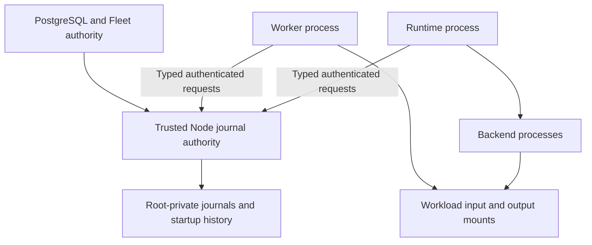

# Journal custody: candidate architecture for the remaining startup closure

Status: preferred candidate for a CPU prototype, not an implemented deployment
contract or an accepted replacement ADR. This assessment follows `df066cf`.
The subsequent [Runtime owner contract](journal-owner-contract-evidence-2026-09-08.md)
now covers all nine ordinary journal mutations. The subsequent
[authenticated journal endpoint](journal-endpoint-evidence-2026-09-08.md)
implements standalone Node file ownership and original-process role binding,
with actual Linux IPC tests. The next
[remote integration](journal-remote-integration-evidence-2026-09-08.md) connects
actual Supervisor operations and Worker-owned Runtime-journal mutations under
explicit test assembly. The subsequent
[context checkpoint](journal-context-evidence-2026-09-08.md) adds per-request
exchange cancellation and shared write/readback deadlines with explicit
read-only retry versus uncertain-mutation fencing.
The subsequent [bounded journal service](journal-server-evidence-2026-09-08.md)
adds the actual accept loop, overload/timeout handling and joined shutdown,
with native Supervisor progress after a measured finite overload burst.
The subsequent [overload recovery correction](journal-overload-recovery-evidence-2026-09-08.md)
keeps an already prepared Supervisor usable after a failed pure read, while
requiring full owner revalidation and preserving uncertain-mutation fences.
The subsequent [Worker barrier validation](journal-worker-barrier-evidence-2026-09-08.md)
exercises actual Worker-to-Runtime gRPC in independent non-root processes during
Prepare/Start overload. Old-execution non-admission or stopped/drain evidence
precedes a useful subsequent execution, under explicit single-member test
orchestration. Cancellation acknowledgement alone never restores capacity.
Production composition, separate Worker journal custody,
protected startup assembly and startup permission integration remain open.
The full objective remains correct, recoverable Stage execution with bounded
resources and verified system behavior; passing a startup observation is not
the completion criterion.

## The boundary that observation alone cannot close

The current source establishes these separate facts:

- [Protected provisioning](../internal/workerbootstrap/provision_linux.go)
  preserves root-private initial records but hands scratch and both admission
  journals to UID/GID 10001.
- [Fleet assembly](../internal/fleetcontroller/worker_instance_actuator.go)
  still uses UID/GID 10001 and recurring recursive scratch ownership changes.
  It does not yet implement the protected provisioning/mount protocol.
- [Runtime file ownership](../internal/modelruntime/execution_state_file.go)
  catches visible replacement and mutation while the original process retains
  its in-memory digest and lock. After process loss, journal bytes do not by
  themselves prove the latest state against a writer who owned those bytes.
- [Passive lock observation](../internal/nodeagent/runtime_file_lock_linux.go)
  explicitly does not establish uninterrupted ownership or exclude unlock/relock
  and descriptor-reuse ABA. It deliberately avoids retaining the workload lock.
- [Executable observation](../internal/nodeagent/runtime_executable_linux.go)
  hashes the live executable file but does not authenticate all effective
  configuration, loaded memory or every writer sharing the workload UID.
- [Complete snapshot verification](../internal/modelruntime/execution_journal_snapshot.go)
  now checks all journal semantics but cannot manufacture provenance/freshness
  from an owner-supplied snapshot.

This is a gap in the prerequisites for a future permission issuer. It is not a
claim that the current code has issued an unsafe production permit: that issuer
does not exist, and current recovery remains deliberately restrictive.

Repeated point-in-time reads can detect visible changes. They cannot, without
an additional trust mechanism, prove that an untrusted writer never changed and
restored the same bytes between observations. More matching fields or more
retries do not change that distinction. Root administrators, host-kernel
compromise, physical storage rollback and inode reuse remain outside the local
guarantee in either architecture.

## Alternatives

| Candidate | What it improves | Remaining cost or proof obligation |
| --- | --- | --- |
| Workload-owned journals plus more Node observations | Reuses existing local file owners and avoids normal-path IPC. | Requires a complete account of every writer, effective launch and continuity; sampled locks/digests alone are insufficient. |
| Separate trusted Runtime/Worker UID from backend/resolver UIDs and mounts | Can preserve direct journal writes while excluding less-trusted descendants. | Requires actual process/mount/user isolation for all writers, including resolver helpers and inherited descriptors; current shared UID/mount assembly does not supply it. |
| Node-private journal authority with typed local requests | Removes workload filesystem write authority over durable restrictions and startup history. Reuses the existing trusted Node and local durable-state boundary. | Adds a local IPC dependency and failure domain during admission; requires measured latency, throughput and explicit lost-response/recovery rules. |

Prototype the third candidate first. It offers a simpler ownership invariant to
test directly. This is an engineering hypothesis, not a performance result or
proof of global architectural optimality. Keep the second candidate available
if the local authority's measured costs or complexity outweigh its advantages.

## Proposed ownership and operations

PostgreSQL remains authoritative for scheduling, leases, epochs, approved
residency and current activation. A Node journal authority owns only local
restrictions and process associations; it cannot create Stage authority or
certify Device availability independently of Fleet.

Root-private admission directories never enter workload mounts and never undergo
recursive workload `chown`. Workloads receive only input/output storage and the
explicit authenticated service endpoint. The Node maps an approved member and
retained process owner to storage; clients cannot select a filesystem path.

The API must expose domain transitions, not `replace snapshot` or arbitrary
append. The root owner independently validates signed inputs and enforces
monotonicity, scope, bounds and idempotency for admission, floors, renewal
candidates, exact drain/non-admission evidence and startup records. A client
cannot erase a watermark, reset lifecycle or reinterpret historical absence by
submitting a self-consistent full document.

Worker and Runtime roles must be checked independently, using the authenticated
actual sender and approved container/process identity. Possessing a socket FD or
sharing UID 10001 must not confer another process's journal authority. The
backend must not inherit a usable broker channel or become an authorized writer
merely because it descends from the Runtime.

The shared pure `executionJournal` validators are a reusable prerequisite.
Filesystem ownership stays in the existing owner; a network adapter must not
duplicate its state machine or bypass full validation. Runtime memory can cache
state but cannot override the root-owned durable restrictions after reconnect.

## Startup and failure protocol requirements

The CPU prototype must exercise the whole protocol, including positive progress:

1. Fresh first use consumes the existing Registry claim, initializes private
   local state and records the exact pair before exposing a member endpoint.
2. Node independently binds the authenticated original process owner, current
   Fleet activation, effective approved executable/configuration, Registry pair
   and journal state. Local startup intent precedes any permission response.
3. A durable permission outcome authorizes exactly the intended owner and nonce.
   Local filesystem and PostgreSQL commits are not claimed to be one atomic
   distributed transaction. Specify their ordering, uncertainty states and
   reconciliation explicitly.
4. Response loss, disconnect, process death and Node restart preserve committed
   identity and history. Retry must either return a proven same-owner outcome
   or drive explicit reconciliation; it cannot infer a fresh attempt from
   timeout, missing PID metadata or an empty replacement directory.
5. Safe Runtime replacement requires independently established exact-owner exit
   and the relevant writer/device evidence. Node-owned bytes do not turn a
   lost pidfd, driver acknowledgement or `Close` return into retirement proof.
6. Ordinary successful Jobs must advance through output publication, input and
   backend exclusion, exact scratch retirement, capacity release and bounded
   history. A protocol that only refuses every uncertain state is incomplete.

The new dependency has to be explicit: when Node journal service is unavailable,
new transitions needing durability cannot be admitted from volatile client
caches. Already accepted operations, cancellation and terminal reporting need
documented bounded behavior and tests. No live model should be unloaded merely
to recover a Worker control connection.

## CPU prototype acceptance and measurement

Use actual root and workload processes, Unix IPC and durable filesystem writes.
Use the real PostgreSQL service for activation/claim integration; fake model
backends are sufficient initially. Preserve all existing Stage graph,
single-Charge, member/AUX, exact-cache isolation and floor/epoch invariants.

Required observations:

- Workload attempts to open, rewrite, unlink, rename, hard-link, chmod or reach
  Node records through mounts/procfs fail. A sibling/descendant cannot acquire
  another role by reusing an endpoint or descriptor.
- Signed legal transitions succeed, illegal/conflicting/replayed transitions
  preserve durable restrictions, and clients cannot submit a replacement state.
- Crash injection before and after every durable acknowledgement proves the
  documented recovery outcome, including a successful normal restart path.
- A complete latest-source mock Job sequence demonstrates no duplicate backend
  permission, no duplicate customer Charge and no unbounded retained resources.
- Compare direct local persistence with the broker using identical operation
  mixes, record sizes and sync policy. Report median and tail admission latency,
  throughput, fsync counts, CPU and memory; include both single-member and
  contended multi-member cases.
- Run sustained arrivals with concurrency/backpressure and injected disconnects.
  Report offered versus completed work, queue age, rejection/timeout rate,
  correctness invariants and retained bytes over time. Drained waves are useful
  regression tests but cannot substitute for this measurement.

Do not set a new fixed latency threshold from an unmeasured microbenchmark.
Compare with the existing end-to-end service budget and determine whether this
dependency materially changes the limiting resource or tail latency.

Migration must not silently adopt workload-owned history as newly independent
evidence. Existing states remain under their original contracts until an
explicit, proven transition or independently authorized fresh membership is
available. No production mount, initializer, schema or startup-grant behavior
is changed by this design note. Production Gate and real GPU evidence remain
separate from CPU protocol correctness.
